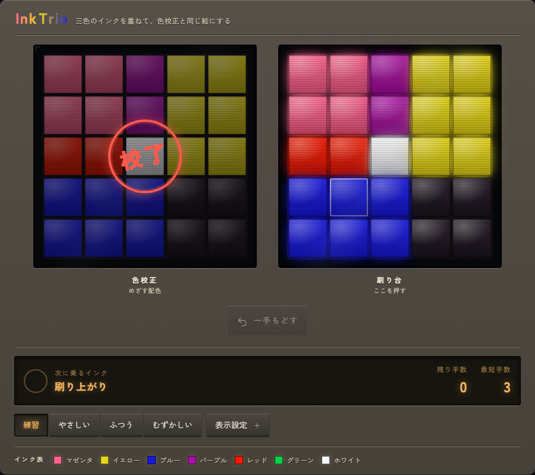
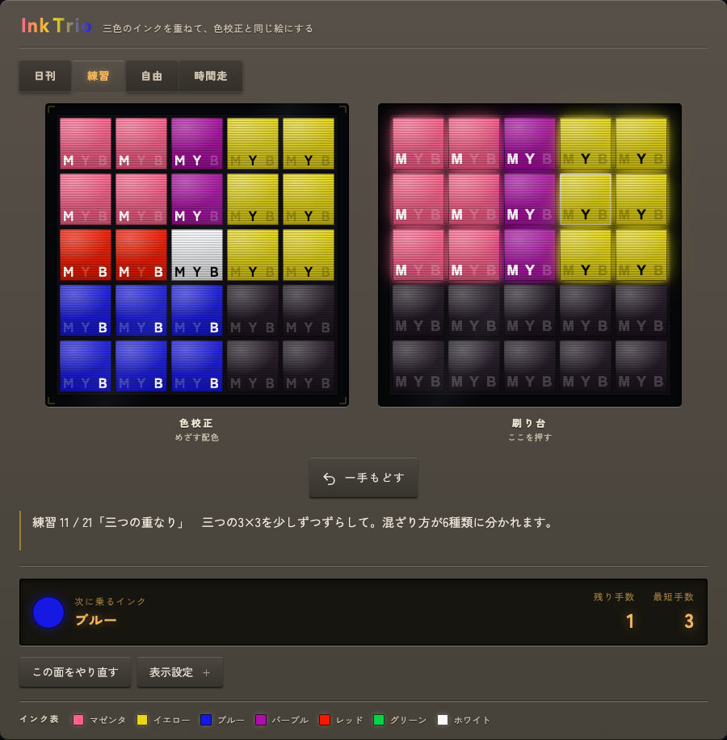
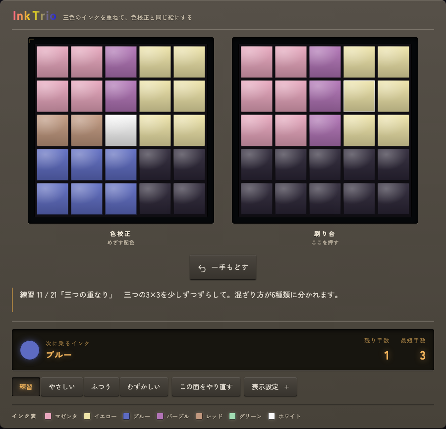

# Ink Trio

三色のインクを重ねて、色校正と同じ配色をつくる 5×5 パズル。

## 遊び方

- 盤のマスを**左クリック**すると、そこを中心とした 3×3 にインクが乗る（盤の外へ出た分は切り落とし）
- 乗るインクは押すたびに **マゼンタ → イエロー → ブルー** の順で循環する
- 重なりは XOR。同じインクを二度重ねると打ち消し、三色そろうと白になる
- 押せるのは**最短手数まで**。使い切ったら「一手もどす」で戻してやり直す
- 左の「色校正」と同じ配色にできたら完成

## 置き方

`index.html` 単体で動きます。ビルドもサーバー側の処理も不要です。

- 静的ホスティング（GitHub Pages、Netlify、Cloudflare Pages など）にそのまま置く
- ファイルをダブルクリックしてブラウザで直接開いてもプレイできる

## 外部からの読み込み

書体のみ Google Fonts から読んでいます（Zen Kaku Gothic New）。
オフラインで使う場合、読み込みに失敗しても端末の既定書体に落ちるので動作に影響はありません。
完全に自己完結させたい場合は `<head>` の `<link rel="preconnect">` と
`<link href="https://fonts.googleapis.com/...">` の 3 行を削除してください。

## 進行度の保存

localStorage に `inktrio.v1` というキーで保存します。保存されるのは以下だけです。

- 練習の到達面数と達成した面
- 難易度ごとの通算クリア数、今日ぶんのクリア数と日付
- 表示設定（目印・画面・配色・音）と選択中の難易度

外部への送信は一切ありません。保存領域が使えない環境では静かに諦め、その旨を画面に表示します。
「表示設定 → 記録 → 記録を消す」で全て削除できます。

## 表示設定

| 項目 | 内容 |
|---|---|
| 目印 | 色以外で配合を示す方法。帯／記号（M・Y・B）／数字（0〜7）／なし |
| 画面 | ブラウン管風の走査線と発光／フラット |
| 配色 | ビビッド／パステル |
| 音 | Web Audio で合成。外部音源なし |
| 補助 | ズレを示す／答えを見る |

配色は一般色覚・P型・D型・T型の 4 通りで最小 ΔE が最大になるよう数値最適化し、
明度が等間隔の階段になるよう配置しています。文字コントラストは全要素で WCAG AA を満たします。

## キーボード操作

| キー | 動作 |
|---|---|
| 矢印 | 盤上の移動 |
| Enter / Space | インクを乗せる |
| Z / Backspace | 一手もどす |
| Escape | 自動遷移の中断、設定パネルを閉じる |

## ライセンス

MIT License。詳細は [LICENSE](LICENSE) を参照してください。
